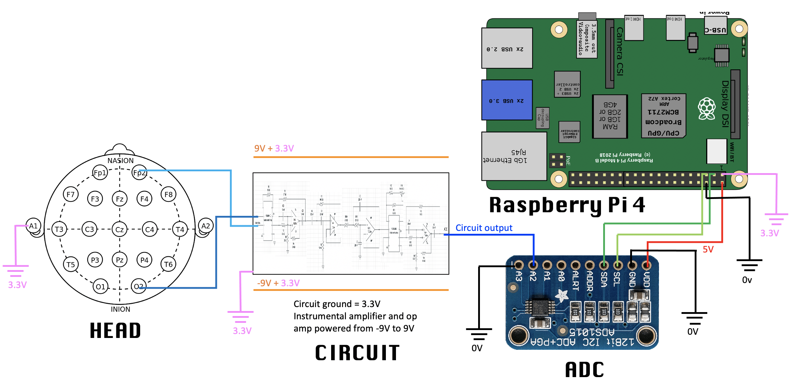

# Project Description 

This project builds an EEG device that measures brain waves--specifically the alpha waves. EEG use electrodes to measure the voltage difference in brain regions with similar spatial orientations. These voltage differences oscillate and represent synchronized activity over a network of neurons. Depending on the electrode placements, brain waves have different characteristic frequency, magnitude, and are related to different brain activties. In our project, we measure alpha waves originating from the occipital lobe because they are one of the strongest EEG signals. Alpha waves have a signature frequency in the range of 8-12 HZ. It reflects activities of the visual cortex: it is increased with closed eyes and relaxation, and decreased with open eyes and concentration. 

In our project, we use a circuit to amplify the electrode signals from the brain, and uses a number of high pass, low pass, and notch filters to filter out frequencies outside of 8-12 HZ. Then, we take data with a raspberry pi 4 and post-process the data using digital filters and analyze it with statistical methods. In the end, we successfully captured alpha waves and observed that its magnitude varies significantly from concentrated state to relaxed state. Furthermore, we came up with three applications that utilizes the fact that alpha waves have distinct magnitudes between concentrated state and relaxed state:

1st application: use EEG to play "EEG bird" (modeled after flappy bird). 
* https://youtu.be/KFIHE_fInmM

2nd application: use EEG to monitor child concentration level. We had fun making this video!!
* https://youtu.be/HQ8krHOXocc 

3rd application: use EEG to communicate simple words, in hope to help paralized people communicate.
* https://youtu.be/74iM_w6vFuU

We based our project on the guidance of an amazing article instructables.com/DIY-EEG-and-ECG-Circuit/. However, we created our own circuit design, wrote our own code for data-taking and analysis, and included unique and fun applications. We hope this Github Repositary can help people implement and debug their own EEG circuit. Make sure to check out the circuit debugging tips section if you are working on a similar project and your circuit doesn't work!

# Methods

## List of Components
* Raspberry Pi 4
* [TDE-2143-C EEG Gold Cup Electrodes](http://www.discountdisposables.com/index.php?act=viewProd&productId=16)
* Electrode gel, tape
* [Instrumental Amplifier AD622ANZ](https://www.analog.com/media/en/technical-documentation/data-sheets/AD622.pdf)
* [Quad Operational Amplifier TL084x](https://www.ti.com/lit/ds/symlink/tl081a.pdf?HQS=dis-dk-null-digikeymode-dsf-pf-null-wwe&ts=1619312373475&ref_url=https%253A%252F%252Fwww.digikey.ca%252F)
* Potentiometer CT6EW102-ND, 1kOhm
* Capacitors and Resistors
* two 9V batteries and battery cases
* Bread board and wires
* ADC Chip
* Multimeter (for testing circuit)
* Open Scope MZ (Used as oscilloscope and wave generator for testing circuit only due to covid, if you have access to a real oscilloscope and wave generator, lucky you and go for those)

## Wiring
 

The above diagram describes the complete EEG setup. The user tapes 3 electrodes to their scalp at various locations to measure the brain's electrical signals. These elcetrodes are attached to the circuit, which serves to amplify alpha waves and filter out other signals. The voltage output of the circuit is measured with the ADC and the data is sent to the Rpi. The Rpi applies further digital filtering and outputs the voltage of the user's alpha waves.

Note that we have two different grounds; the ADC and Rpi ground (black) at 0V, and the circuit ground (pink) at 3.3V. This design choice is due to ADC input voltage limitations and is explained in detail later. To get the -9V to 9V of power with respect to the 3.3V ground, connect one 9V battery the correct way, and the other one backwards.

Here is a picture of the physical setup:

## Eletrode Placement for Alpha Waves Measurements
There are many possible electrode placements depending on what wave one choose to measure. In our project, we measure alpha waves. We need to use three electrode: one at the left mastoid (the bone at the back of the left ear) which is connected to the ground of the circuit. This electrode helps with noise cancelling; one located one inch above and one inch right of the nasion (the midline bony depression between the eyes where the frontal and two nasal bones meet); the last one located one inch above and one inch right of the inion (the projecting part of the occipital bone at the base of the skull). The 2nd and 3rd electrode placements are approximately in O2 and Fp2 regions in the below diagram:

The voltage difference oscillations between the 2nd and 3rd electrodes are the target alpha waves, which is then fed to the circuit to be amplified and filtered.

## Circuit Schematic

The circuit consist of the following sections:
* Instrumental Amplifier (gain ~91)
* Notch Filter (60 HZ, gain = 1)
* High Pass Filter (Fc = 7.2 Hz, gain = 1)
* Low Pass Filter (Fc = 32.9 Hz, gain = 1)
* Instrumental Amplifier with variable gain (gain ~ 90-460)
* Notch Filter (60 HZ, gain = 1)

The total filter responses (no gain) is shown below:

Individual Section are discussed further below.

### Instrumental Amplifier (gain ~91)

Alpha wave signals is 15-50 uV so we need a lot of amplification in the circuit. (LETS CITE INFORMATION)
An instrumentation amplifier takes as its inputs, 2 voltages, and outputs the difference between the two multiplied by some gain given by: G = 1 + (50.5 kOhm)/R, where R is the total resistance between pin 1 and 8. Note it is possible to make home-made instrumentation amplifier usually with 3 op-amps. However, it suffers from a low CMRR unless precision resitors are used. (indo from Instructable)

### 1st Notch Filter (60 HZ, gain = 1)

 

The biggest source of noise in our system is centered at 60 Hz due to power line interference. This noise is present even though we use batteries to power the circuit. Thus we have 2 notch filters in the circuit (filters that have a severe reduction of gain around 1 particular frequency). The first notch filter intends to filter out interference before more gains are applied. 

* [More readings on PLI in biopotentials applications](https://www.intechopen.com/books/compendium-of-new-techniques-in-harmonic-analysis/cancelling-harmonic-power-line-interference-in-biopotentials)

The notch frequency is given by f = 1/(2 PI R C) where R = R3 = R5. The other two resistor values are related to the quality factor of the filter, which determines how sharp the attenuation is.

* [More information on notch filters](https://www.electronicshub.org/band-stop-filter/)

### High Pass Filter (Fc = 7.2 Hz)

 

The high pass filter intends to filter out frequencies corresponding to galvanic skin response across our head. This interference is primarily low frequency. A second order active filter design is used here and is shown to be necessary for noise reduction. 

* [More information on second order filters](https://www.electronics-tutorials.ws/filter/second-order-filters.html)

### Low Pass Filter (Fc = 32.9 Hz)

 

The EEG waves of interest to our project are alpha (8-12 HZ) and beta waves (12-30 HZ). Thus, we are not interested in frequency > 30HZ and filter them out. A second order filter design is used.

* [More information on second order filters](https://www.electronics-tutorials.ws/filter/second-order-filters.html)

### Instrumental Amplifier with variable gain (gain ~ 90-460)

 

This 90-460 gain is on top of the 90x gain from the first instrumentation amplifier. Alpha wave amplitude varies from person to person, from about 10 to 30 uV. Using a middle value of 20 uV, this means the ending voltage reading could range from 90*90*20e-6 = 0.162V to 460*90*20e-6 = 0.828V. The variable gain is achieved by putting resitors in series and in parallel. The gain is roughly in the range of 90-460, which corresponds to potentiometer value 1k (maximum) to 0 (minimum).

To adjust the potentiometer, start taking readings and make sure one is not moving at all. Make sure voltages don't fluctuate offscreen, but avoid making it too small because then the errors incurred from digitally reading the data into rpi would be relatively increased. 

### 2nd Notch Filter (60 HZ, gain = 1)

 

Another 60 HZ is necessary at the end of the circuit since the power line interferences seep into the circuit through prior steps. This is the exact copy of the 1st notch filter

### Connecting ADC to Rpi
Supply the ADC chip with 5V from Rpi to ensure the maximum input voltage range possible. The pin configuration and connection in the image above is correct, but it is reccomended to double check the connection, because wiring mistakes can lead to damaging the chip and or the Rpi.

## Circuit Debugging Tips
If circuit doesn't work:
* Check every individual section and make sure it is doing its job
* Read data sheet and make sure nothing is over-strained
* Use multimeter and oscilloscope to check everything! 
* We are not circuit pro but listen to circuit pros: http://web.mit.edu/6.101/www/reference/TheArtofDebuggingCircuits.pdf
* Switch out Op Amps, which are easy to break.

If you don't see brain wave:
* Most likely it is because the electrode placement is wrong. To solve this issue: look up what is the systematic and best practices in setting up electrodes, look up 10-20 EEG Measuring System, test it on a friend, wash your hair, etc
* Try switching the electrode wires feeding into the instrumental amplifier, you could be amplifying negative voltages
* Switch out Op Amps, which are easy to break.

## Post-processing (LINK THE CODE IN GITHUB TO EACH RELEVANT SECTION)
### Data Taking Methods

### Digital Filtering
Example of using digital filter to keep 8-12 HZ components and inverse fourier transform back to time series:

 

### Gaussian Analysis and Voltage Threshold 

This code is created to 1) find the optimal voltage threshold which separates relaxed and concentrated data and 2) Evaluate how distinct the relaxed and concentrated datasets using statistical analysis.

We approximate concentrated and relaxed brain wave data sets each as normal Gaussian distributions. The cross point of the two gaussians give the best threshold voltage V0 which separates relaxed and concentrated data. This voltage threhold would minimizes overall wrong classifications. The overlap area divided by 2 give the probability of wrong classification since we have two normal distributions. More specifically, the ratio of overlap area left of V0 to right of V0 gives the percentage of wrong estimation being we guessed concentrated but is actually relaxed.

The following are the data from Hak and Ryan, applied with Gaussian analysis. 

 

The above figure contains 30 max concentrated and 30 max relaxed data for each person. One can see that the distribution is indeed different for differrent people and that the relaxed and concentrated states are very distinct. In fact, the fail rate according to the Gaussian distribution is: Ryan: 0.01%, Hak: 0.0001%. However, do take this with a grain of salt because we do see some data right next to the threshold. This is likely due to we have not accounted for the artifacts. We also don't know if we can really assume the distribution is normal. Also notice that the concentrated distribution is much narrower than the relaxed one. This shows that it is much harder to relax than to concentrate: it is easy to make sure one is concentrate by looking at colorful images and doing mental calculations. However, even when one is relaxed, it could still be hard to control involuntary eye movements and thoughts, which could possibly have an effect on alpha wave magnitude. Also, the diagram does not indicate that there is no mid-level between the concentration and relaxation gaussians. The sharp distinction between concentrated and relaxed population is simply due to when taking the data, the person is trying their hardest to concentrate/relax.

# Alpha Wave Data Visualized

The following are examples of post-processed concentrated and relaxed data from the same person. It is clear that the magnitude of the waves are very different:

Example of fourier transform (from raw data) shows clear spike in the alpha wave 8-12 Hz range:

# Applications

All of the following application relies on the singular fact that alpha wave magnitude increases in relaxed state and decreases in concentrated state. Calibration is also very necessary for all of the applications since alpha wave magnitude varies from person to person, and since the gain of the second amplifier is adjustable.

## Flappy Bird

Concentrated: positive velocity, the bird flies up. Relaxed: negative velocity, the bird flies down. 
This does make the game play more difficult since one often needs to shift the 

# Future improvement
### Artefact Removal Using Independent Component Analysis

The circuit has already shown success in filtering out noise in a wide frequency range (caused by skin, power line, etc). However, it is still subject to artefact signals unrelated to the brain waves of interest. The method we would like to experiment in the future is independent component analysis (ICA). It has shown to be a robust method used for EEG in field as well as in research to separate mixture of brain activities, as well as to eliminate contamination of signals by eye movements, blinks, muscle, heart and line noise.

ICA is a signal processing method to separate independent sources linearly mixed in several sensors. ICA recovers a version of the original sources, by multiplying the data with an unmixing matrix: U = WX, where X is the data with dimension (channel * time), U is the ICA source activties (components * time), and W is the ICA unmixing matrix.
ICA separates out the independent components by finding W such to minimize the gaussianicity of each data set.

To apply ICA to EEG data, we assume the following
* Mixing is linear at electrodes
* Propagation Delays are negligible
* Component time courses are independent
* Number of components are equal or less than the number of channels

We cannot apply ICA to our current circuit because we are limited by the number of electrodes. As mentioned above, we need to increase the number of electrodes our circuit can accomodate in order to separate out enough artifact components.

### Improve Precision of Electrode Placements
This is arguably the biggest unresolved challenge in our project. The electrode placements need to be rather precise to capture the signals. The fact that skull varies from person to person poses additional difficulty. A clear scalp free of oil and dendrites is also important. We need to find a systematic method to find electrode placement, and potentially use more robust tools other than tape. We have our eyes on the following link as a start point: https://www.ers-education.org/lrmedia/2016/pdf/298830.pdf

### Beta Waves
This circuit should also be capable of measuring beta waves, which are in the frequency range 12-30 HZ. Beta wave is essentially the opposite of alpha waves in the sense that it is increased with concentration and decreased with relaxation. We would like to try this next.

# Acknowledgement
Many thanks to Professor Andrew Jayich, our lovely TAs Beaks and Mingyu for supporting us and guiding us along the way.
Special thanks to Rei for giving us a huge bread board and starring in the "naughty naughty movie"

# References
* The project owes much thanks to instructables.com/DIY-EEG-and-ECG-Circuit/. We have based our procedures and methods on the instructions in this article, but we created our own circuit design and wrote our own code for data-taking and analysis. 
* Flappy bird code reference: https://github.com/clear-code-projects/FlappyBird_Python
* Independent Component Analysis: http://arnauddelorme.com/ica_for_dummies/; youtube series https://www.youtube.com/watch?v=kWAjhXr7pT4&list=PLXc9qfVbMMN2uDadxZ_OEsHjzcRtlLNxc&index=2; https://sccn.ucsd.edu/~jung/Site/EEG_artifact_removal.html
* EEG and Alpha Wave informtions are largely from Wikipedia.

